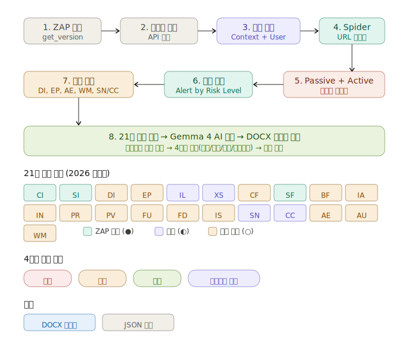

# 주요정보통신기반시설 웹 취약점 자동 진단 툴

2026 주요정보통신기반시설 기술적 취약점 분석·평가 방법 상세가이드 - Web Application(웹) **21개 항목** 기준

## 웹 스캐너 8 Step



## 빠른 시작

```bash
# 이미 로컬에 설치된 환경 (Ollama + gemma4:e4b + ZAP)
pip install requests python-dotenv python-docx  # 최초 1회

# 비인증 스캔
python web-scanner.py https://대상URL

# 인증 스캔
python web-scanner.py https://대상URL \
  --login-url https://api.example.com/auth/login \
  --login-data '{"email":"","password":""}' \
  --username user@test.com \
  --password password123 \
  --logged-in "\\Q로그아웃\\E" \
  --logged-out "\\Q로그인\\E" \
  --api-backend https://api.example.com
```

## 21개 점검 항목

| 코드 | 항목 | ZAP 커버리지 | 점검 방법 |
|------|------|:---:|------|
| CI | 코드 인젝션 | ● | ZAP Active Scan |
| SI | SQL 인젝션 | ● | ZAP Active Scan |
| DI | 디렉터리 인덱싱 | ○ | 수동 (HTTP 요청) |
| EP | 에러 페이지 적용 미흡 | ○ | 수동 (비정상 URL 테스트) |
| IL | 정보 누출 | ◐ | ZAP Passive + 수동 |
| XS | 크로스사이트 스크립팅 | ◐ | ZAP Active + CSP 분석 |
| CF | 크로스사이트 요청 위조 | ○ | 수동 (인증 구조 분석) |
| SF | 서버사이드 요청 위조 | ● | ZAP Active Scan |
| BF | 약한 비밀번호 정책 | ○ | 수동 |
| IA | 불충분한 인증 절차 | ○ | 수동 (CAPTCHA/MFA) |
| IN | 불충분한 권한 검증 | ○ | 수동 (IDOR 테스트) |
| PR | 취약한 비밀번호 복구 | ○ | 수동 |
| PV | 프로세스 검증 누락 | ○ | 수동 |
| FU | 악성 파일 업로드 | ○ | 수동 |
| FD | 파일 다운로드 | ○ | 수동 |
| IS | 불충분한 세션 관리 | ○ | 수동 (토큰/쿠키 분석) |
| SN | 데이터 평문 전송 | ◐ | ZAP Passive + 수동 |
| CC | 쿠키 변조 | ◐ | ZAP Passive + 수동 |
| AE | 관리자 페이지 노출 | ○ | 수동 (경로 접근 테스트) |
| AU | 자동화 공격 | ○ | 수동 (CAPTCHA 확인) |
| WM | 불필요한 Method 악용 | ○ | 수동 (HTTP Method 테스트) |

● = ZAP 자동  ◐ = ZAP + 수동 혼합  ○ = 수동 점검

## 출력 보고서

```
docs/
  vuln_report_YYYYMMDD_HHMMSS.docx       # 가이드 양식 DOCX
  vuln_report_YYYYMMDD_HHMMSS.json       # 기계 판독용 JSON
logs/
  scan_YYYYMMDD_HHMMSS.log              # 스캔 로그
```

### DOCX 보고서 구조
1. 점검 개요 (대상, 도구, 방법, 기준)
2. 점검 결과 요약 (판정 분포 + 21개 항목 현황 테이블)
3. 점검 항목별 상세 결과 (21개 항목 각각)
4. ZAP 자동화 스캔 상세 결과 (CWE, URL, 설명)
5. 종합 의견 및 권고사항 (AI 생성)

## ZAP MCP 연동 (Claude Desktop/Claude in Chrome)

이 스크립트는 ZAP REST API를 직접 호출하지만, ZAP MCP 플레이북과 동일한 8단계를 따릅니다.
Claude Desktop이나 Claude in Chrome에서 ZAP MCP를 직접 사용하려면 `ZAP_MCP_Playbook_v2.md`를 첨부하세요.

## 필수 환경

| 구성 요소 | 용도 | 설치 |
|----------|------|------|
| **OWASP ZAP** | 프록시/스캐너 (port 8090) | Docker 또는 로컬 설치 |
| **Ollama + gemma4:e4b** | AI 취약점 분석 (port 11434) | `ollama pull gemma4:e4b` |
| **python-docx** | DOCX 보고서 생성 | `pip install python-docx` |
| **Python requests** | HTTP 통신 | `pip install requests python-dotenv` |

## 주의사항

- **반드시 사전 승인을 받고 수행하세요**
- Active Scan은 실제 공격 패턴을 전송합니다
- AI 분석은 참고용이며 최종 판정은 보안 전문가가 수행해야 합니다
- `수동점검 필요` 항목은 별도 수동 테스트가 필요합니다
